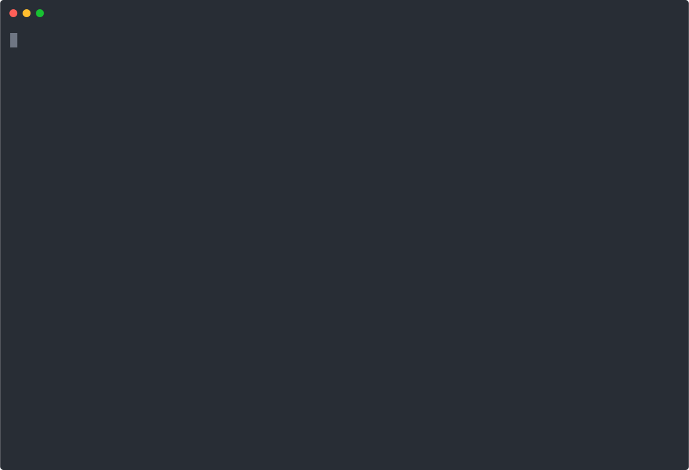

# <a id="0"></a>Table of contents generator for Markdown

- [Introduction](#1)
- [Usage](#2)
  - [Docker](#2-1)
  - [npm](#2-2)
  - [Programmatic](#2-3)
- [Example](#3)

<!-- Table of contents is made with https://github.com/eugene-khyst/md-toc-cli -->


## <a id="1"></a>Introduction

Automatically insert or update a clickable table of contents (TOC) into your Markdown documents based on its headings using CLI or JavaScript module with the perfect support for `README.md` files on GitHub.

**md-toc-cli** creates table of contents from level 2-6 headings (e.g., `## Heading`, `### Heading` etc.) and inserts it after level 1 heading or at the beginning of the file.
Zero or one level 1 heading is expected (e.g., `# Heading`).

HTML anchor elements are added to level 1-6 headings to make table of content items clickable, e.g. `<a id="..."></a>`.

Anchor at level 1 heading allows creating [Back to top](#0) links as `[Back to top](#0)`.



## <a id="2"></a>Usage

**md-toc-cli** is available as [npm package](https://www.npmjs.com/package/md-toc-cli) and [Docker image](https://hub.docker.com/r/eugenekhyst/md-toc-cli).

### <a id="2-1"></a>Docker

When running **md-toc-cli** using Docker, mount the directory containing the Markdown files as a volume.

1. Insert table of contents to the `README.md` file in the current directory
   ```bash
   docker run --rm -v .:/markdown eugenekhyst/md-toc-cli -i README.md
   ```
2. Read the manual

   ```bash
   docker run --rm -v .:/markdown eugenekhyst/md-toc-cli --help
   ```

   ```
   md-toc-cli [file]

   Automatically insert or update a clickable table of contents (TOC) into your
   Markdown documents based on its headings (levels 2-6).

   Positionals:
     file  Markdown file for inserting or updating table of contents in
                                                    [string] [default: "README.md"]

   Options:
         --version           Show version number                          [boolean]
         --help              Show help                                    [boolean]
     -i, --in-place          Edit file in place          [boolean] [default: false]
     -s, --suffix            The extension of a backup copy. If no extension is
                             supplied, the original file is overwritten without
                             making a backup. This option implies -i.      [string]
     -t, --tab-width         The number of spaces per indentation-level
                                                              [number] [default: 2]
     -l, --list-item-symbol  Symbol used in front of line items to create an
                             unordered list
                                   [string] [choices: "-", "*", "+"] [default: "-"]
     -n, --no-attribution    Do not add an attribution "Table of contents is made
                             with ..."                   [boolean] [default: false]
   ```

### <a id="2-2"></a>npm

When running **md-toc-cli** using Node.js, install the package globally for convenience.

1. Make sure Node.js 18.x LTS or newer is installed.
2. Install **md-toc-cli** as a global package
   ```bash
   npm i -g md-toc-cli
   ```
3. Insert table of contents to the `README.md` file in the current directory
   ```bash
   md-toc-cli -i README.md
   ```
4. Read the manual

   ```bash
   $ md-toc-cli --help
   ```

### <a id="2-3"></a>Programmatic

**md-toc-cli** can be used as a library in JavaScript and TypeScript projects.

1. Make sure Node.js 18 or newer is installed.
2. Install md-toc-cli
   ```bash
   npm i md-toc-cli
   ```
3. Import md-toc-cli functions
   ```javascript
   import { insertOrUpdateToc, insertOrUpdateTocInFile } from 'md-toc-cli';
   ```
4. Programmatically insert or update the table of contents in a Markdown string or file
   ```javascript
   insertOrUpdateToc(markdownContent, {
     tabWidth: 2,
     listItemSymbol: '-',
     noAttribution: false,
   });
   ```
   ```javascript
   await insertOrUpdateTocInFile('README.md', {
     inPlace: false,
     suffix: 'orig',
     tabWidth: 2,
     listItemSymbol: '-',
     noAttribution: false,
   });
   ```

## <a id="3"></a>Example

1. Create file `test.md` as follows

   ```markdown
   # Heading 1

   ## Heading 2a

   ### Heading 3aa

   #### Heading 4a

   ##### Heading 5a

   ###### Heading 6a

   ### Heading 3ab

   ## Heading 2b

   ### Heading 3b

   #### Heading 4b

   ## Heading 2c

   ### Heading 3c
   ```

2. Insert table of contents to `test.md` and backup the original file
   ```bash
   md-toc-cli test.md -i -s 'orig'
   ```
3. A backup `test.md.orig` is created for original file `test.md`.
4. A clickable table of contents is inserted into `test.md`

   ```markdown
   # <a id="0"></a>Heading 1

   <!-- Table of contents is made with https://github.com/eugene-khyst/md-toc-cli -->

   ## <a id="1"></a>Heading 2a

   ### <a id="1-1"></a>Heading 3aa

   #### <a id="1-1-1"></a>Heading 4a

   ##### <a id="1-1-1-1"></a>Heading 5a

   ###### <a id="1-1-1-1-1"></a>Heading 6a

   ### <a id="1-2"></a>Heading 3ab

   ## <a id="2"></a>Heading 2b

   ### <a id="2-1"></a>Heading 3b

   #### <a id="2-1-1"></a>Heading 4b

   ## <a id="3"></a>Heading 2c

   ### <a id="3-1"></a>Heading 3c
   ```

5. Make any change to the level 2-6 headings (e.g. delete level 5-6 headings and rename level 3 headings).
6. Update the table of contents in `test.md`
   ```bash
   md-toc-cli -i test.md
   ```
7. The table of contents in `test.md` is updated according to the level 2-6 headings.
